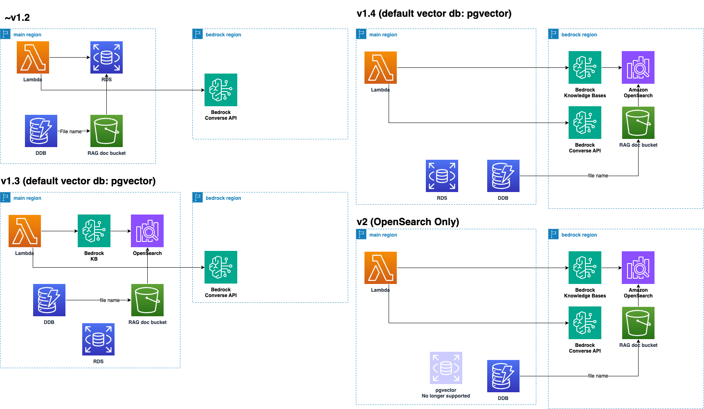

# คู่มือการย้ายเวอร์ชัน (จาก v1 ไปยัง v2)

## สรุปย่อ

- **สำหรับผู้ใช้เวอร์ชัน v1.2 หรือเก่ากว่า**: อัปเกรดเป็นเวอร์ชัน v1.4 และสร้างบอทใหม่โดยใช้ฐานความรู้ (KB) หลังจากระยะเปลี่ยนผ่าน เมื่อคุณยืนยันว่าทุกอย่างทำงานได้ตามปกติกับ KB แล้ว ให้ดำเนินการอัปเกรดเป็น v2
- **สำหรับผู้ใช้เวอร์ชัน v1.3**: แม้ว่าคุณกำลังใช้ KB อยู่ ก็ **แนะนำอย่างยิ่ง** ให้อัปเกรดเป็นเวอร์ชัน v1.4 และสร้างบอทใหม่ หากคุณยังคงใช้ pgvector ให้ย้ายโดยการสร้างบอทใหม่โดยใช้ KB ใน v1.4
- **สำหรับผู้ใช้ที่ต้องการใช้ pgvector ต่อไป**: ไม่แนะนำให้อัปเกรดเป็น v2 หากคุณวางแผนที่จะใช้ pgvector ต่อไป การอัปเกรดเป็น v2 จะลบทรัพยากรที่เกี่ยวข้องกับ pgvector ทั้งหมด และการสนับสนุนในอนาคตจะไม่มีอีกต่อไป ในกรณีนี้ให้ใช้ v1 ต่อไป
- โปรดทราบว่า **การอัปเกรดเป็น v2 จะส่งผลให้ทรัพยากร Aurora ทั้งหมดถูกลบ** การอัปเดตในอนาคตจะมุ่งเน้นไปที่ v2 โดยเฉพาะ และ v1 จะถูกยกเลิก

## บทนำ

### สิ่งที่จะเกิดขึ้น

การอัปเดต v2 นำเสนอการเปลี่ยนแปลงครั้งใหญ่โดยการแทนที่ pgvector บน Aurora Serverless และการฝังบน ECS ด้วย [Amazon Bedrock Knowledge Bases](https://docs.aws.amazon.com/bedrock/latest/userguide/knowledge-base.html) การเปลี่ยนแปลงนี้ไม่สามารถใช้งานร่วมกับเวอร์ชันก่อนหน้าได้

### เหตุผลที่คลังข้อมูลนี้ได้นำ Knowledge Bases มาใช้และยกเลิก pgvector

มีหลายเหตุผลสำหรับการเปลี่ยนแปลงนี้:

#### การปรับปรุงความแม่นยำของ RAG

- Knowledge Bases ใช้ OpenSearch Serverless เป็นแบ็กเอนด์ ช่วยให้สามารถค้นหาแบบผสมผสานด้วยการค้นหาข้อความเต็มและการค้นหาเวกเตอร์ ซึ่งนำไปสู่ความแม่นยำที่ดีขึ้นในการตอบคำถามที่มีชื่อเฉพาะ ซึ่ง pgvector มีปัญหา
- ยังสนับสนุนตัวเลือกเพิ่มเติมสำหรับการปรับปรุงความแม่นยำของ RAG เช่น การแบ่งส่วนและการแยกวิเคราะห์ขั้นสูง
- Knowledge Bases มีให้ใช้งานทั่วไปมาเกือบปีแล้วนับตั้งแต่เดือนตุลาคม 2024 พร้อมคุณสมบัติต่างๆ เช่น การคลานเว็บ การอัปเดตในอนาคตคาดว่าจะทำให้การนำฟังก์ชันขั้นสูงมาใช้ง่ายขึ้นในระยะยาว ตัวอย่างเช่น แม้ว่าคลังข้อมูลนี้ยังไม่ได้ใช้คุณสมบัติเช่นการนำเข้าจาก S3 บัคเก็ตที่มีอยู่ (ซึ่งเป็นคุณสมบัติที่ร้องขอบ่อย) ใน pgvector แต่ KB (Knowledge Bases) รองรับแล้ว

#### การบำรุงรักษา

- การตั้งค่า ECS + Aurora ปัจจุบันขึ้นอยู่กับไลบรารีจำนวนมาก รวมถึงไลบรารีสำหรับการแยกวิเคราะห์ PDF การคลานเว็บ และการดึงข้อความถอดเสียงจาก YouTube เปรียบเทียบกับโซลูชันที่มีการจัดการอย่าง Knowledge Bases ซึ่งลดภาระการบำรุงรักษาสำหรับผู้ใช้และทีมพัฒนาคลังข้อมูล

## กระบวนการย้ายข้อมูล (สรุป)

เราขอแนะนำอย่างยิ่งให้อัปเกรดเป็นเวอร์ชัน 1.4 ก่อนการย้ายไปยังเวอร์ชัน 2 ใน v1.4 คุณสามารถใช้ทั้ง pgvector และบอตฐานความรู้ ซึ่งจะช่วยให้มีช่วงเปลี่ยนผ่านเพื่อสร้างบอต pgvector ของคุณใหม่ใน Knowledge Base และตรวจสอบว่าทำงานได้อย่างคาดหวัง แม้ว่าเอกสาร RAG จะยังคงเหมือนเดิม โปรดสังเกตว่าการเปลี่ยนแปลงส่วนหลังของ OpenSearch อาจทำให้ผลลัพธ์แตกต่างเล็กน้อย แต่โดยทั่วไปจะคล้ายคลึงกัน เนื่องจากความแตกต่างของอัลกอริทึมค่าเคียงเคียง

โดยการตั้งค่า `useBedrockKnowledgeBasesForRag` เป็น true ใน `cdk.json` คุณสามารถสร้างบอตโดยใช้ Knowledge Bases ได้ อย่างไรก็ตาม บอต pgvector จะกลายเป็นแบบอ่านอย่างเดียว ป้องกันการสร้างหรือแก้ไขบอต pgvector ใหม่


ใน v1.4 [Guardrails for Amazon Bedrock](https://aws.amazon.com/jp/bedrock/guardrails/) ก็ถูกนำมาใช้ด้วย เนื่องจากข้อจำกัดทางภูมิภาคของ Knowledge Bases บัคเก็ต S3 สำหรับอัปโหลดเอกสารต้องอยู่ในภูมิภาคเดียวกับ `bedrockRegion` เราขอแนะนำให้สำรองบัคเก็ตเอกสารที่มีอยู่ก่อนการอัปเดต เพื่อหลีกเลี่ยงการอัปโหลดเอกสารจำนวนมากด้วยตนเองในภายหลัง (เนื่องจากมีฟังก์ชันการนำเข้าบัคเก็ต S3 ให้ใช้งาน)

## กระบวนการย้ายข้อมูล (รายละเอียด)

ขั้นตอนจะแตกต่างกันไปขึ้นอยู่กับว่าคุณใช้เวอร์ชัน v1.2 หรือเก่ากว่า หรือ v1.3



### ขั้นตอนสำหรับผู้ใช้ v1.2 หรือเก่ากว่า

1. **สำรองข้อมูลบักเก็ตเอกสารที่มีอยู่ (ไม่บังคับ แต่แนะนำ)** หากระบบของคุณกำลังทำงานอยู่ เราขอแนะนำอย่างยิ่งให้ทำขั้นตอนนี้ สำรองข้อมูลบักเก็ตที่ชื่อ `bedrockchatstack-documentbucketxxxx-yyyy` ตัวอย่างเช่น เราสามารถใช้ [AWS Backup](https://docs.aws.amazon.com/aws-backup/latest/devguide/s3-backups.html)

2. **อัปเดตเป็น v1.4**: ดึงแท็กล่าสุด แก้ไข `cdk.json` และปรับใช้ ทำตามขั้นตอนเหล่านี้:

   1. ดึงแท็กล่าสุด:
      ```bash
      git fetch --tags
      git checkout tags/v1.4.0
      ```
   2. แก้ไข `cdk.json` ดังนี้:
      ```json
      {
        ...,
        "useBedrockKnowledgeBasesForRag": true,
        ...
      }
      ```
   3. ปรับใช้การเปลี่ยนแปลง:
      ```bash
      npx cdk deploy
      ```

3. **สร้างบอทใหม่**: สร้างบอทใหม่บน Knowledge Base ด้วยคำจำกัดความเดิม (เอกสาร ขนาดชัก เป็นต้น) เหมือนกับบอท pgvector หากคุณมีเอกสารจำนวนมาก การกู้คืนจากการสำรองข้อมูลในขั้นตอนที่ 1 จะทำให้กระบวนการนี้ง่ายขึ้น หากต้องการกู้คืน เราสามารถใช้การกู้คืนสำเนาข้ามภูมิภาค สำหรับรายละเอียดเพิ่มเติม เยี่ยมชม[ที่นี่](https://docs.aws.amazon.com/aws-backup/latest/devguide/restoring-s3.html) หากต้องการระบุบักเก็ตที่กู้คืน ให้ตั้งค่าส่วน `S3 Data Source` ดังนี้ โครงสร้างเส้นทางคือ `s3://<ชื่อบักเก็ต>/<ไอดีผู้ใช้>/<ไอดีบอท>/documents/` คุณสามารถตรวจสอบไอดีผู้ใช้ได้ที่ Cognito user pool และไอดีบอทบนแถบที่อยู่ในหน้าจอสร้างบอท


**โปรดทราบว่ามีบางคุณสมบัติที่ไม่พร้อมใช้งานบน Knowledge Bases เช่น การคลานเว็บและการสนับสนุนการถอดความ YouTube (วางแผนที่จะสนับสนุนตัวคลานเว็บ ([ปัญหา](https://github.com/aws-samples/bedrock-claude-chat/issues/557))) นอกจากนี้ โปรดทราบว่าการใช้ Knowledge Bases จะมีค่าใช้จ่ายสำหรับทั้ง Aurora และ Knowledge Bases ระหว่างการเปลี่ยนผ่าน**

4. **ลบ APIs ที่เผยแพร่**: จำเป็นต้องเผยแพร่ APIs ที่เคยเผยแพร่ทั้งหมดใหม่ก่อนการปรับใช้ v2 เนื่องจาก VPC ถูกลบ หากต้องการทำเช่นนี้ คุณจำเป็นต้องลบ APIs ที่มีอยู่ก่อน การใช้[คุณสมบัติการจัดการ API ของผู้ดูแลระบบ](../ADMINISTRATOR_th-TH.md) สามารถทำให้กระบวนการนี้ง่ายขึ้น เมื่อการลบสแตก CloudFormation ของ `APIPublishmentStackXXXX` เสร็จสิ้น สภาพแวดล้อมจะพร้อมใช้งาน

5. **ปรับใช้ v2**: หลังจากการเผยแพร่ v2 ดึงซอร์สที่มีแท็กและปรับใช้ดังนี้ (ซึ่งจะเป็นไปได้เมื่อเผยแพร่):
   ```bash
   git fetch --tags
   git checkout tags/v2.0.0
   npx cdk deploy
   ```

> [!คำเตือน]
> หลังจากปรับใช้ v2 **บอทที่มีคำนำหน้า [ไม่รองรับ, อ่านอย่างเดียว] จะถูกซ่อน** ตรวจสอบให้แน่ใจว่าคุณสร้างบอทที่จำเป็นใหม่ก่อนอัปเกรดเพื่อหลีกเลี่ยงการสูญเสียการเข้าถึง

> [!เคล็ดลับ]
> ระหว่างการอัปเดตสแตก คุณอาจพบข้อความซ้ำๆ เช่น: ตัวจัดการทรัพยากรส่งข้อความกลับ: "ซับเน็ต 'subnet-xxx' มีการพึ่งพาและไม่สามารถลบได้" ในกรณีเช่นนี้ ไปที่ Management Console > EC2 > Network Interfaces และค้นหา BedrockChatStack ลบอินเตอร์เฟซเครือข่ายที่แสดงที่เชื่อมโยงกับชื่อนี้เพื่อช่วยให้กระบวนการปรับใช้ราบรื่นขึ้น

### ขั้นตอนสำหรับผู้ใช้ v1.3

ตามที่กล่าวมาก่อนหน้านี้ ใน v1.4 Knowledge Bases จะต้องถูกสร้างในภูมิภาค bedrockRegion เนื่องจากข้อจำกัดทางภูมิภาค ดังนั้นคุณจะต้องสร้าง KB ใหม่ หากคุณได้ทดสอบ KB ใน v1.3 แล้ว ให้สร้างบอทใหม่ใน v1.4 ด้วยคำจำกัดความเดียวกัน ทำตามขั้นตอนที่อธิบายสำหรับผู้ใช้ v1.2